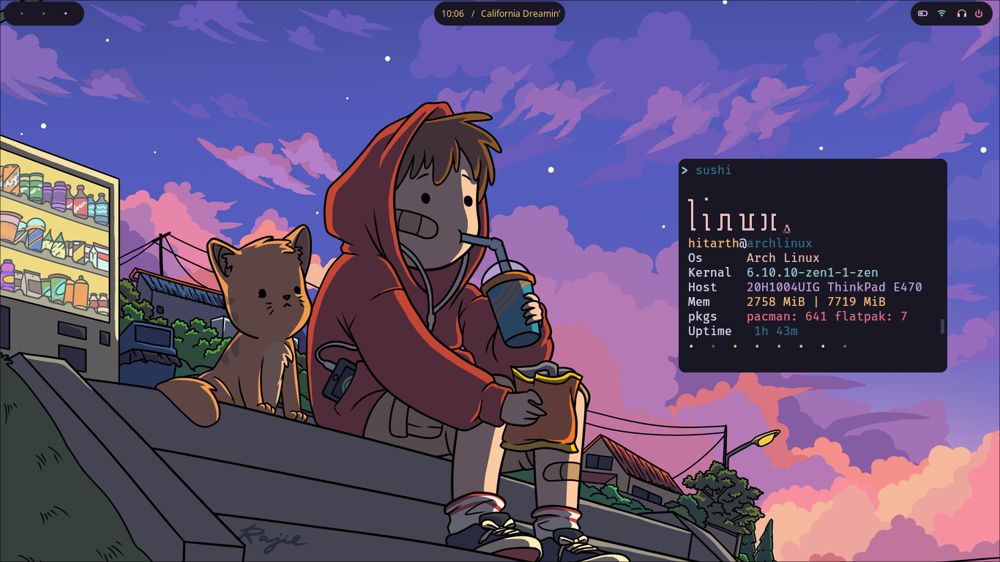

# 'Sushi'

<h3>
  simple fetch written in go for linux
</h3>


# Installation

```fish
git clone https://github.com/h1tarxeth/sushi.git
cd sushi
make build
sudo mv sushi /usr/bin/
```

# customize

    just edit cmd/main.go
    you can add you ascii-art,enable other function
